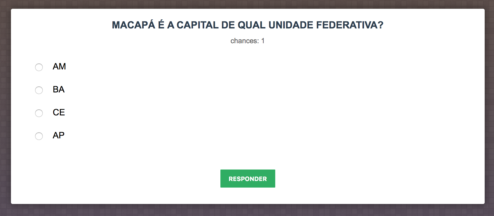

## Projeto em Prolog para auxiliar o ensino e aprendizagem de Geografia do Brasil.
###### Atividade acadêmica [IABV 2016]
Marcelo Barbosa [@github/marcelobns](https://github.com/marcelobns)

## Manual
* [Instalação](https://github.com/marcelobns/prolog_quiz#instalação)
* [Uso](https://github.com/marcelobns/prolog_quiz#uso)
* [Manutenção](https://github.com/marcelobns/prolog_quiz#manutenção)

## Instalação
Para a utilização deste projeto você primeiro deve instalar a versão mais recente do [swi-prolog](http://www.swi-prolog.org/Download.html).

Qualquer dúvida ou problemas na instalação do swi-prolog consulte a [documentação](http://www.swi-prolog.org/pldoc/doc_for?object=manual).

Então faça o [download](https://github.com/marcelobns/prolog_quiz/archive/master.zip) deste projeto ou clone-o em sua máquina :
```
$ git clone https://github.com/marcelobns/prolog_quiz.git
```
Em seu terminal do prolog ou na ferramenta swipl dentro do terminal do seu sistema operacional, Selecione o arquivo principal do projeto "server.pl" e inicie o servidor web do prolog na porta que for mais conveniente :
```
$ consult('prolog_quiz/server.pl').
$ server(88).
```
pronto! seu servidor está rodando em: [http://localhost:88](http://localhost:88)

## Uso
##### A interface é simples e intuitiva, contendo um formulário para responder as perguntas sobre geografia do Brasil.

##### E ao final de cada rodada de perguntas é exibido uma tela com o resultado.


## Manutenção
#### Estrutura do projeto
* prolog_quiz
    * commom
        * **handler.pl**
    * controllers
        * **app_controller.pl**
    * models
        * **app_model.pl**
        * estados.json
        * perguntas.json
    * web
        * css
        * fonts
        * img
        * js
        * index.html
    * **server.pl**

Os principais arquivos utilizados no projeto são ["server.pl", "handler.pl", "app_model.pl", "app_controller.pl"].

#### server.pl
Arquivo de inicialização do servidor web e definição das rotas.
```
server(Port) :- http_server(server_handler, [port(Port)]).

:- route_get(/, index()).
:- route_get(validation/Id/Key/Value, answer(Id, Key, Value)).
```
