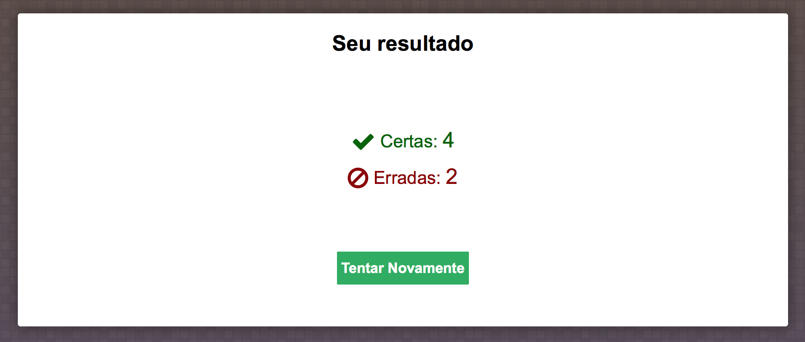

## Projeto em Prolog para auxiliar o ensino e aprendizagem de Geografia do Brasil.
###### Atividade acadêmica [IABV 2016]
Marcelo Barbosa [@github/marcelobns](https://github.com/marcelobns)

Projeto construído utilizando apenas **SWI-PROLOG** no Backend, criando um serviço **web** e fornecendo a lógica para o consumo no frontend, que está escrito em **HTML, CSS e JS**.<br>
Os fatos estão armazenados em arquivos **JSON** e são traduzidos para **DICTS** do prolog para facilitar a interpretação da lógica.


## Manual
* [Instalação](https://github.com/marcelobns/prolog_quiz#instalação)
* [Uso](https://github.com/marcelobns/prolog_quiz#uso)
* [Manutenção](https://github.com/marcelobns/prolog_quiz#manutenção)
* [Implementações Futuras](https://github.com/marcelobns/prolog_quiz#implementações-futuras)
* [Licença de Uso](https://github.com/marcelobns/prolog_quiz/blob/master/LICENSE)

## Instalação
Para a utilização deste projeto você primeiro deve instalar a versão mais recente do [swi-prolog](http://www.swi-prolog.org/Download.html).

Qualquer dúvida ou problemas na instalação do swi-prolog consulte a [documentação](http://www.swi-prolog.org/pldoc/doc_for?object=manual).

Então faça o [download](https://github.com/marcelobns/prolog_quiz/archive/master.zip) deste projeto ou clone-o em sua máquina :
```
$ git clone https://github.com/marcelobns/prolog_quiz.git
```
Em seu terminal do prolog ou na ferramenta swipl dentro do terminal do seu sistema operacional

Talvez seja necessário a instalação do pacote arouter, que auxilia na criação de rotas http:
```
$ pack_install(arouter).
```
Para executar o projeto selecione o arquivo principal do projeto "server.pl" e inicie o servidor web do prolog na porta que for mais conveniente :
```
$ consult('prolog_quiz/server.pl').
$ server(88).
```
pronto! seu servidor está rodando em: [http://localhost:88](http://localhost:88)

## Uso
##### A interface é simples e intuitiva, contendo um formulário para responder as perguntas sobre geografia do Brasil.

##### E ao final de cada rodada de perguntas é exibido uma tela com o resultado.


## Manutenção
#### Estrutura do projeto
* prolog_quiz
    * commom
        * **handler.pl**
    * controllers
        * **app_controller.pl**
    * models
        * **app_model.pl**
        * estados.json
        * perguntas.json
    * web
        * css
        * fonts
        * img
        * js
        * index.html
    * **server.pl**

Os principais arquivos utilizados no projeto são ["server.pl", "handler.pl", "app_model.pl", "app_controller.pl"].

#### server.pl
Arquivo de inicialização do servidor web e definição das rotas:
```
server(Port) :- http_server(server_handler, [port(Port)]).

:- route_get(/, index()).
:- route_get(validation/Id/Key/Value, answer(Id, Key, Value)).
```
#### handler.pl
Arquivo com definição dos caminhos para servir os arquivos estáticos e manipuladores de rotas:
```
server_handler(Request) :- (route(Request) ; http_dispatch(Request)).

:- http_handler('/css', assets_handler, [prefix]).
```
#### app_controller.pl
Arquivo que controla a lógica do projeto, definição dos métodos de acesso a camada model e recebem requests definidas pelas rotas em server.pl:
```
index() :-
    json_to_dict('prolog_quiz/models/perguntas.json', Perguntas),
    json_to_dict('prolog_quiz/models/estados.json', Estados),

    format('Content-Type: text/html; charset=UTF-8~n~n'),
    current_output(Out),
    st_render_file('prolog_quiz/web/index', _{
            title: 'Quiz de Geografia',
            perguntas: Perguntas,
            estados: Estados
        }, Out, _{ frontend: semblance }
    )
.
```
## Implementações Futuras
* Ajuste na manipulação dos caminhos absoluto e relativo do projeto.
* Melhor uso do arquivo app_model.pl

## Licença de Uso
GNU GENERAL PUBLIC LICENSE <br>
   Version 3, 29 June 2007
